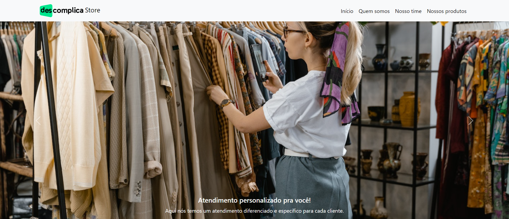

<p align='center'>
    
</p>

<h1 align='center'>Descomplica Store</h1>



<p align='center'>
  <a href='#technologies-and-tools-used'>Technologies and tools</a> •
  <a href='#project-description'>Project description</a> •
  <a href='#status'>Status</a> •
  <a href='#run'>How to run</a> •
  <a href='#license'>License</a> •
  <a href='#author'>Author</a>
</p>

<h2 id="technologies-and-tools-used">Technologies and tools used</h2>

<p align="center">
  <a href="https://skillicons.dev">
    
  </a>
</p>

<h2 id='project-description'>Project description</h2>

This project is a Descomplica + Nubank test. The main objective is to create a virtual store (clothes or shoes) using the basic techs HTML, CSS and Bootstrap.

<h2 id='status'>Status</h2>

<h3 align='center'>Done ✔</h3>

<h2 id='run'>How to run</h2>

1. Clone the repo with 

    ```
    git clone https://github.com/AnteroJunior/descomplica-html-css-bootstrap.git
    ```

2. Open <code>index.html</code> file on your browser

<h2 id='license'>License</h2>
    <p align='center'>
        
    </p>

<h2 id='author'>Author</h2>
    <div align='center'>
        
        <h3>Antero Júnior</h3>
        <p>Made with ❤️ by Antero Júnior
        <p style='text-align: center'>
            <a href='https://www.linkedin.com/in/antero-arcanjo/' target='_blank'></a>
            <a></a>
        </p>
    </div>
